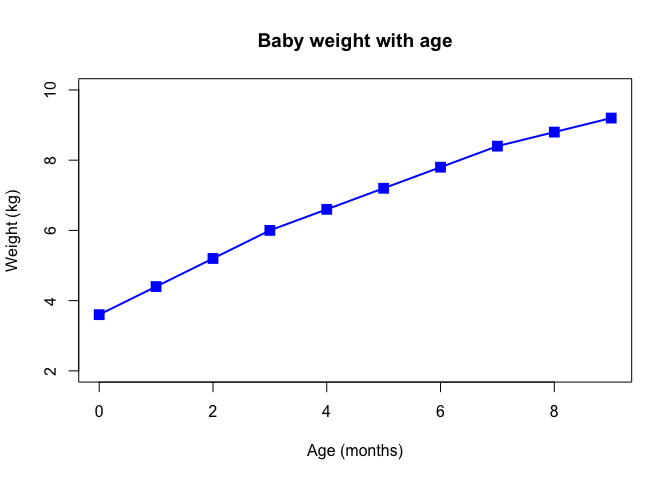
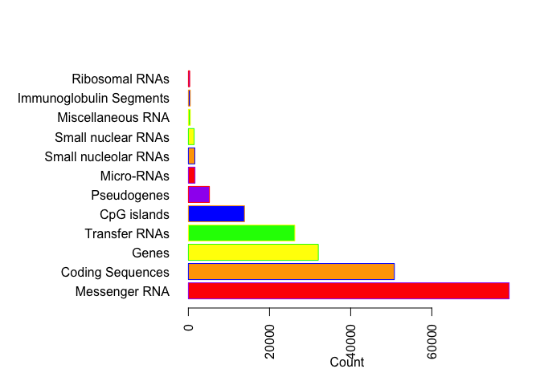
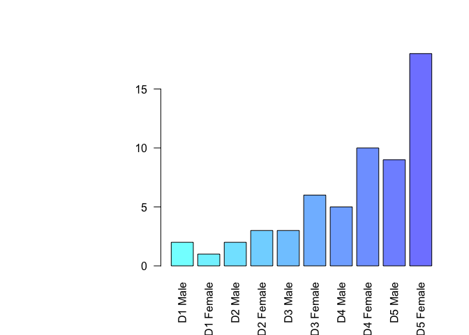
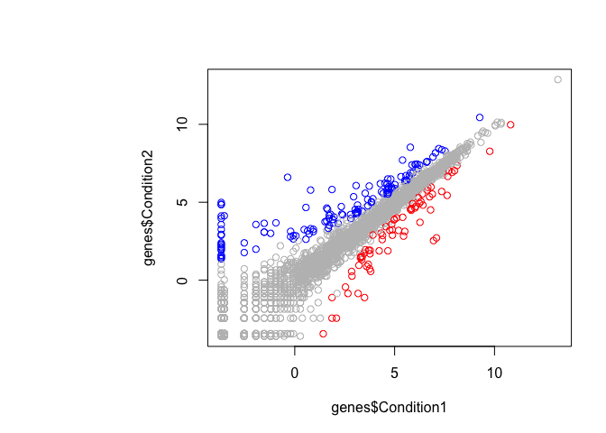
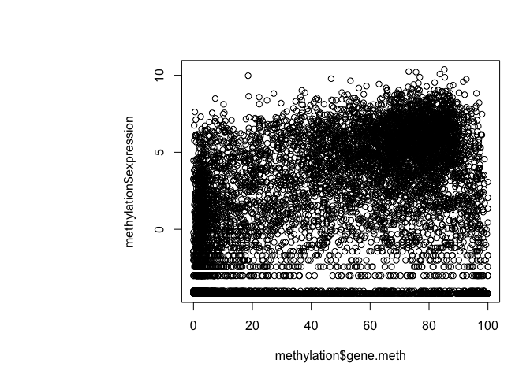

Class 5
================
Megan Hayes
January 25th, 2019

``` r
# Class 5 Graphics and Plots with R
```

**bold** *italic*

``` r
# Section 2A: line plot
weight <- read.table("bimm143_05_rstats/weight_chart.txt", head = TRUE)
plot(weight, typ = "o", pch = 15, col = "blue", cex = 1.5, lwd = 2, ylim = c(2, 10), xlab = "Age (months)", ylab = "Weight (kg)", main = "Baby weight with age")
```



``` r
# Barplot
feature_counts <- read.table("bimm143_05_rstats/feature_counts.txt", head = TRUE, sep = "\t")
par(mar = c(5, 12, 4, 2))
barplot(feature_counts$Count, names.arg = feature_counts$Feature, las = 2, horiz = TRUE, xlab = "Count", col = c("red", "orange", "yellow", "green", "blue", "purple"), border = c("purple", "blue", "green", "yellow", "orange", "red"))
```



``` r
#Histograms
MF <- read.table("bimm143_05_rstats/male_female_counts.txt", sep = "\t", head = TRUE)
barplot(MF$Count, names.arg = MF$Sample, las = 2, col = rainbow(30, start = .5, end = 1, s = 0.5))
```



``` r
# Genes
genes <- read.delim("bimm143_05_rstats/up_down_expression.txt")

table(genes$State)
```

    ## 
    ##       down unchanging         up 
    ##         72       4997        127

``` r
palette(c("red", "grey", "blue"))
plot(genes$Condition1, genes$Condition2, col = genes$State)
```



``` r
# Methylation
methylation <- read.delim("bimm143_05_rstats/expression_methylation.txt")
plot(methylation$gene.meth, methylation$expression)
```


