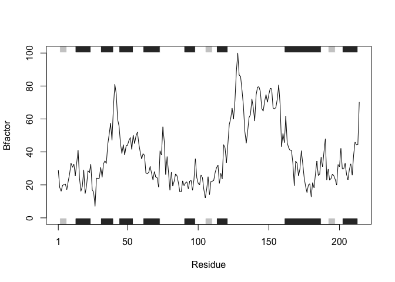
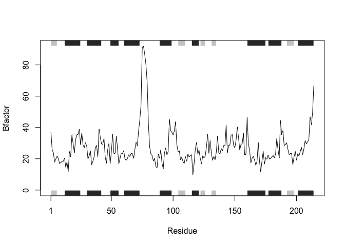
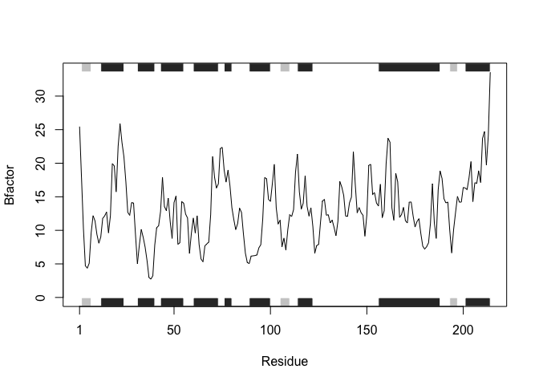

Class 6 R Functions
================
Megan Hayes
January 25, 2019

Insert a code chunk

``` r
file1 <- "https://bioboot.github.io/bggn213_W19/class-material/test1.txt"  
data1 <- read.csv(file1)
data1
```

    ##   Col1 Col2 Col3
    ## 1    1    2    3
    ## 2    4    5    6
    ## 3    7    8    9
    ## 4    a    b    c

``` r
file2 <- "https://bioboot.github.io/bggn213_W19/class-material/test2.txt"  
data2 <- read.csv(file2, sep = '$')
data2
```

    ##   Col1 Col2 Col3
    ## 1    1    2    3
    ## 2    4    5    6
    ## 3    7    8    9
    ## 4    a    b    c

``` r
file3 <- "https://bioboot.github.io/bggn213_W19/class-material/test3.txt"
data3 <- read.csv(file3, header = FALSE)
data3
```

    ##           V1
    ## 1 1   6   a 
    ## 2  2   7   b
    ## 3 3   8   c 
    ## 4  4   9   d
    ## 5  5   10  e

R functions
-----------

My first function

``` r
add <- function(x, y=1) {
    # Sum the input x and y
    x + y
}
```

``` r
add(x=1, y=4)
```

    ## [1] 5

``` r
add(c(1,2,2))
```

    ## [1] 2 3 3

``` r
add( c(1,2,3,4))
```

    ## [1] 2 3 4 5

``` r
rescale <- function(x) {
    rng <- range(x)
    (x - rng[1])/(rng[2]-rng[1])
}
```

``` r
rescale(1:20)
```

    ##  [1] 0.00000000 0.05263158 0.10526316 0.15789474 0.21052632 0.26315789
    ##  [7] 0.31578947 0.36842105 0.42105263 0.47368421 0.52631579 0.57894737
    ## [13] 0.63157895 0.68421053 0.73684211 0.78947368 0.84210526 0.89473684
    ## [19] 0.94736842 1.00000000

``` r
rescale(c(1,2,NA,3,10))
```

    ## [1] NA NA NA NA NA

``` r
x <- c(1,2,NA,3,10)
```

``` r
rescale2 <- function(x) {
    rng <- range(x, na.rm = TRUE)
    (x - rng[1])/(rng[2]-rng[1])
}
```

``` r
rescale2(c(1,2,NA,3,10))
```

    ## [1] 0.0000000 0.1111111        NA 0.2222222 1.0000000

``` r
rescale3 <- function(x, na.rm=TRUE, plot=FALSE) {
   if(na.rm) {
     rng <-range(x, na.rm=na.rm)
   } else {
     rng <-range(x)
   }
   print("Hello")
   answer <- (x - rng[1]) / (rng[2] - rng[1])
   print("is it me you are looking for?")
   if(plot) {
      plot(answer, typ="b", lwd=4)
}
   print("I can see it in ...")
   return(answer)
}
```

``` r
rescale3(1:10, plot = FALSE)
```

    ## [1] "Hello"
    ## [1] "is it me you are looking for?"
    ## [1] "I can see it in ..."

    ##  [1] 0.0000000 0.1111111 0.2222222 0.3333333 0.4444444 0.5555556 0.6666667
    ##  [8] 0.7777778 0.8888889 1.0000000

``` r
library(bio3d)
```

``` r
pdb <- read.pdb("1hbs")
```

    ##   Note: Accessing on-line PDB file

What is this **pdb** thing?

``` r
pdb
```

    ## 
    ##  Call:  read.pdb(file = "1hbs")
    ## 
    ##    Total Models#: 1
    ##      Total Atoms#: 9104,  XYZs#: 27312  Chains#: 8  (values: A B C D E F G H)
    ## 
    ##      Protein Atoms#: 8760  (residues/Calpha atoms#: 1148)
    ##      Nucleic acid Atoms#: 0  (residues/phosphate atoms#: 0)
    ## 
    ##      Non-protein/nucleic Atoms#: 344  (residues: 8)
    ##      Non-protein/nucleic resid values: [ HEM (8) ]
    ## 
    ##    Protein sequence:
    ##       VLSPADKTNVKAAWGKVGAHAGEYGAEALERMFLSFPTTKTYFPHFDLSHGSAQVKGHGK
    ##       KVADALTNAVAHVDDMPNALSALSDLHAHKLRVDPVNFKLLSHCLLVTLAAHLPAEFTPA
    ##       VHASLDKFLASVSTVLTSKYRVHLTPVEKSAVTALWGKVNVDEVGGEALGRLLVVYPWTQ
    ##       RFFESFGDLSTPDAVMGNPKVKAHGKKVLGAFSDGLAHLDNLKGT...<cut>...HKYH
    ## 
    ## + attr: atom, xyz, seqres, helix, calpha,
    ##         remark, call

``` r
# Can you improve this analysis code?
library(bio3d)
s1 <- read.pdb("4AKE")  # kinase with drug
```

    ##   Note: Accessing on-line PDB file

``` r
s2 <- read.pdb("1AKE")  # kinase no drug
```

    ##   Note: Accessing on-line PDB file
    ##    PDB has ALT records, taking A only, rm.alt=TRUE

``` r
s3 <- read.pdb("1E4Y")  # kinase with drug
```

    ##   Note: Accessing on-line PDB file

``` r
s1.chainA <- trim.pdb(s1, chain="A", elety="CA")
s2.chainA <- trim.pdb(s2, chain="A", elety="CA")
s3.chainA <- trim.pdb(s3, chain="A", elety="CA")
s1.b <- s1.chainA$atom$b
s2.b <- s2.chainA$atom$b
s3.b <- s3.chainA$atom$b
plotb3(s1.b, sse=s1.chainA, typ="l", ylab="Bfactor")
```



``` r
plotb3(s2.b, sse=s2.chainA, typ="l", ylab="Bfactor")
```



``` r
plotb3(s3.b, sse=s3.chainA, typ="l", ylab="Bfactor")
```


